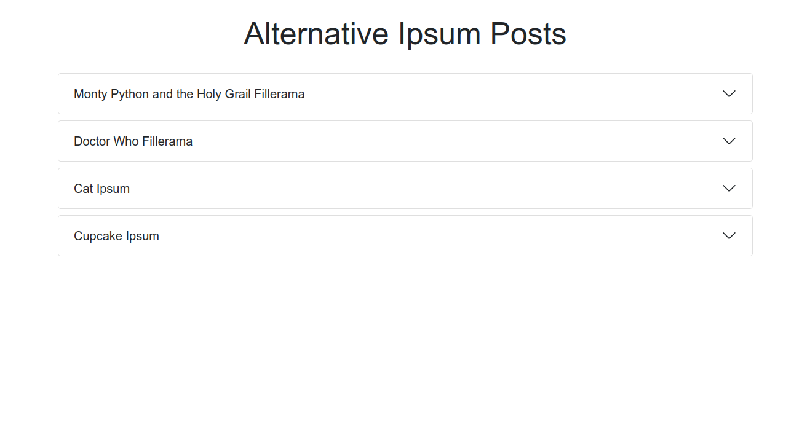

# WordPress Lorem

> WordPress.com posts using the API

## Table of contents

- [General info](#general-info)
- [Screenshots](#screenshots)
- [Technologies](#technologies)
- [Learnings](#learnings)
- [Setup](#setup)
- [Features](#features)
- [Status](#status)
* [Inspiration](#inspiration)
* [Contact](#contact)

## General info

Having learnt that WordPress has an API I wanted to try it out. I also wanted to try Bootstrap in React, so I put those together. I wanted to add photos to the posts, but rather than finding one and adding it to the post directly, I used the Unsplash API. That allowed me to get a random photo that matched the subject, and use Express to hide my API key on the server. With Bootstrap I aimed not to write any CSS, which I achieved. This is not in any way how you'd use these in the real world, but useful to understand what is possible.

## Screenshots



## Technologies

- React
- TypeScript
- Bootstrap
- Express
- Jest
- React Testing Library
- Cypress
- Cypress Testing Library
- WordPress.com API
- Unsplash API

## Learnings

- Bootstrap in React
- WordPress API
- Fetching API in Express
- Hiding API keys in Express

## Features

Shows WordPress.com posts in a Bootstrap Accordion, along with a random related photo from Unsplash.

## Setup

To view this project visit the [demo](http://wordpress-lorem.nicm42.co.uk/) or download the files, open a terminal in that folder and install locally using npm:

```
npm install
```

Go to [Unsplash](https://unsplash.com/documentation), sign up for an account and get an API key.

Add your key into .env.example where it says 'XXX' and rename the file to .env

Run the server and the app locally:

```
npm run dev
npm start
```

## Status

Project is: _finished_

## Inspiration
Lorem Ipsum text used in the posts is from:
* [Fillerama](http://fillerama.io/)
* [Cat Ipsum](http://www.catipsum.com/index.php)
* [Cupcake Ipsum](http://www.cupcakeipsum.com/)

## Contact

Created by [nicm42](https://twitter.com/nicm4242/) - feel free to contact me!
